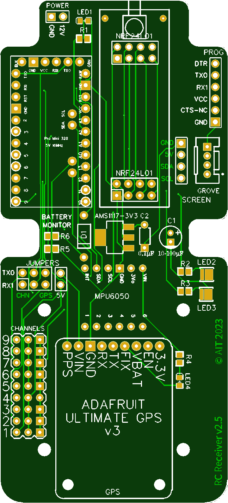
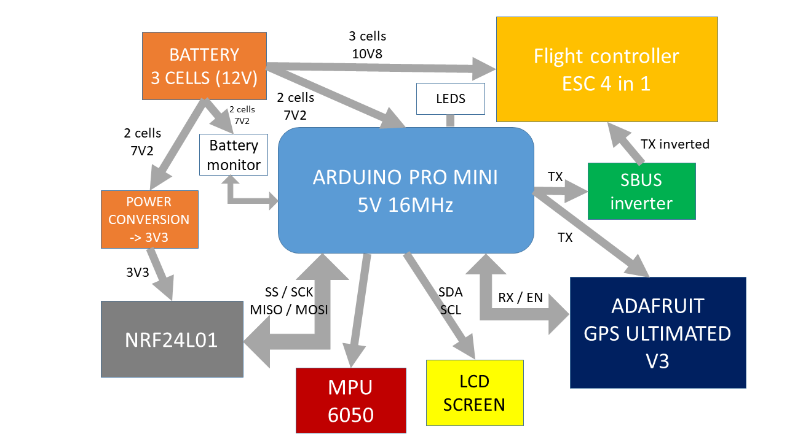

# RC-receiver with flight controller

## PCB
The receiver is based on an Arduino Pro Mini

## FLIGHT CONTROLLER

The flight controller is a SkyStars-rc F405HD2

## ESC

The ESC 4 in 1 is a LANNRC BLHELI_S 45A 60A

## SYNOPTIC

The Arduino is connected to the flight controller using the Futaba SBUS.  
As the Arduino is not able to invert the serial bus, requested by the SBUS protocol,
there is a need to add an inverter between the Arduino and the flight controller..  
A 3 cells LIPO baterry is used to provide power to ESC, flight controller and motor. 
THe battery is also used to provide power to the Arduino and the NRF24L01.
The battery monitor allows the Arduino to check if power supply is enough.  
The MPU and the GPS are provision. They are used when there is no flight controller.  
An LCD screen (2 lines of 16 characters) and LEDs provide information of receiver operation mode.  
Here is the synoptic of the receiver:

For the LCD, see [Groove RGD LCD Backlight on GitHub](https://github.com/Seeed-Studio/Grove_LCD_RGB_Backlight)

## SBUS

The Arduino pro mini is not able to invert the serial signal as required by the Futaba SBUS protocol,
as an ESP32 could do it. To invert the signal, I use a NAZE32 SBUS signal inverter.

Some precisions about SBUS protocol.
The bus speed is 100kbauds, one start bit, 8 bits data, 1 bit for even parity and 2 stop bits.
The MSbit is transmitted first.
The minimum value is 192, corresponding to 1000 µs for motor command.
The maximum value is 1792 corresponding to 2000 µs for motor command.
For more information, see [this usefull link](https://github.com/uzh-rpg/rpg_quadrotor_control/wiki/SBUS-Protocol)

## TRANSMITTER

For the transmitter, see [RC transmitter on GitHub](https://github.com/pascalheude/RC-transmitter)